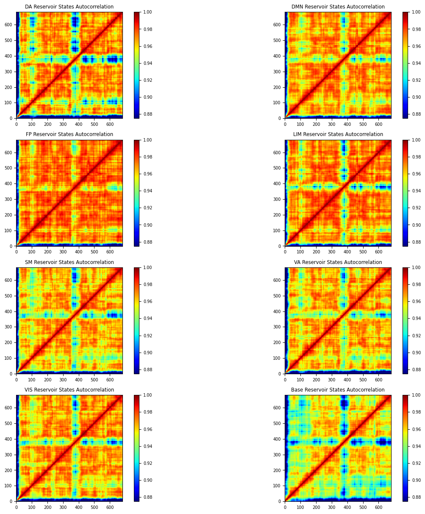
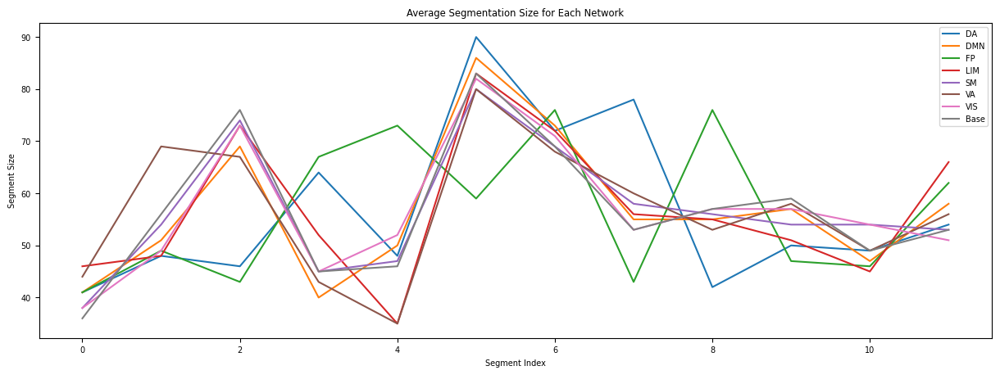

# NarrativeConn2Res
<<<<<<< HEAD
Utilizing the Conn2Res toolbox to explore the effect of anatomically-informed connectivity on reservoir activity segmentation in the Narratives tasks.
=======

## Method
-

## Investigations

### Connectivity Matrices of Conn2Res Networks

### Reservoir States for NotTheFall Narrative

### Autocorrelation by Network for NotTheFall Narrative

### HMM Segmentation Size by Network

>>>>>>> 01a46ea (Initial commit)
